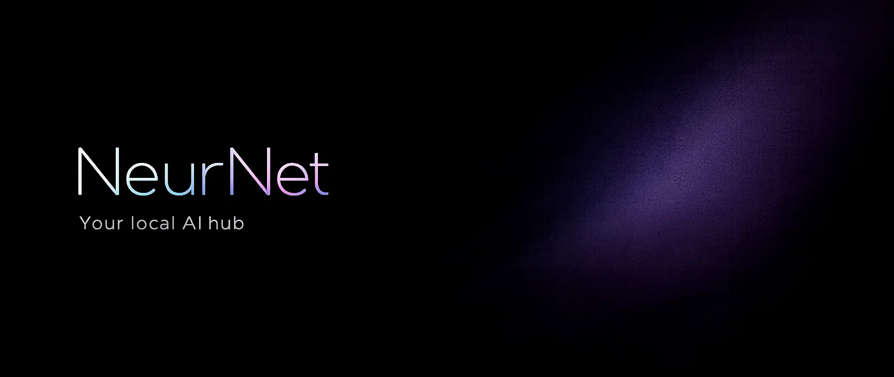

   

# NeurNet — Платформа нейросетей колледжа

**NeurNet** — внутренняя платформа колледжа для работы с генеративными ИИ-моделями. Студенты могут генерировать текст, код и изображения через единый веб-интерфейс, не выходя за пределы локальной сети учреждения.

Доступ к моделям — токенный: каждый запрос списывает один токен. Токены выдаёт преподаватель. Без токенов — без генерации.

---

## Роли пользователей

| Роль | Что может делать |
|------|-----------------|
| **Студент** | Авторизоваться, отправлять запросы к моделям, просматривать историю своих запросов |
| **Преподаватель** | Всё вышеперечисленное + управлять токенами студентов, смотреть их активность |
| **Суперадминистратор** | Полный доступ: управление моделями, настройка интерфейса, просмотр истории всех пользователей |

---

## Как это работает

1. Авторизация через **LDAP колледжа** (те же данные, что и везде в сети)
2. Студент видит доступные модели с версией и датой обновления
3. Выбирает модель, вводит запрос — списывается **1 токен**
4. При одновременных обращениях нескольких пользователей к одной модели запросы **выстраиваются в очередь** по времени отправки
5. Пользователь не может отправить запрос сразу к нескольким моделям одновременно

---

## Типы поддерживаемых моделей

- [x] 📝 Генерация текста
- [ ] 💻 Генерация кода
- [ ] 🖼️ Генерация изображений

---

## Репозитории

| Репозиторий | Роль |
|-------------|------|
| [Neur.Server.Net](https://github.com/NeurNet/Neur.Server.Net) | Backend API — авторизация, токены, очередь запросов, интеграция с моделями, хранение истории |
| [Neur.Client.Web](https://github.com/NeurNet/Neur.Client.Web) | Frontend — пользовательский интерфейс для студентов, преподавателей и администратора |

---